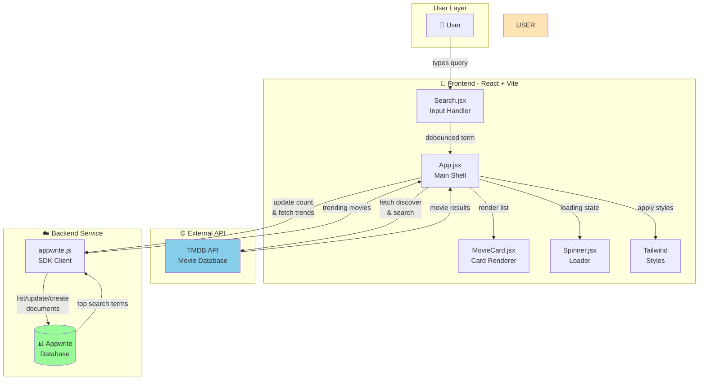

# 🎬 Movie Explorer

[](https://react.dev)
[](https://vitejs.dev)
[](https://tailwindcss.com)
[](LICENSE)

A modern React movie discovery app with real-time search, trending analytics, and beautiful UI.

> **Discover movies. Track trends. Share favorites.**

## ✨ Features

- 🔍 **Instant Search** – Debounced search with TMDB API integration
- 🎯 **Trending Tracker** – Real-time analytics of popular searches with Appwrite
- 🎨 **Beautiful UI** – Tailwind CSS responsive design
- ⚡ **Lightning Fast** – Vite dev server with hot module replacement
- 🔄 **Smart State** – React hooks for efficient data management

## 🚀 Quick Start

```bash
# 1. Install dependencies
npm install

# 2. Set up environment variables (.env.local)
VITE_TMDB_API_KEY=your_api_key
VITE_APPWRITE_PROJECT_ID=your_project_id
VITE_APPWRITE_DATABASE_ID=your_db_id
VITE_APPWRITE_COLLECTION_ID=your_collection_id

# 3. Start dev server
npm run dev

# 4. Open your browser
# → http://localhost:5173
```

## 📖 Table of Contents

- [Features](#-features)
- [Tech Stack](#full-tech-stack)
- [Architecture](#architecture-and-data-flow)
- [Project Structure](#component-structure)
- [Setup Guide](#environment-variables)
- [Development](#run-locally)

## Overview

Movie Explorer is a frontend-first application that:

- 🌐 Fetches movie data from The Movie Database (TMDB) API
- 🔎 Enables powerful search and browsing capabilities
- 📊 Stores and ranks search analytics in Appwrite
- 📈 Displays trending searches based on frequency

## Full Tech Stack

### 🎨 Frontend
| Technology | Purpose |
|-----------|---------|
| **React 18** | Component-based UI framework |
| **Vite 6** | Ultra-fast dev server & build tool |
| **Tailwind CSS 4** | Utility-first styling |
| **React Use** | Debounced search behavior |

### ⚙️ Backend Services (BaaS)
| Service | Purpose |
|---------|---------|
| **Appwrite Cloud** | Backend-as-a-Service platform |
| **Appwrite SDK** | JavaScript client library |
| **Appwrite Databases** | Document storage & analytics |

### 📦 External APIs
- **TMDB API v3** – Movie data, discover & search endpoints
- **Base:** `https://api.themoviedb.org/3`
- **Authentication:** Bearer token via `VITE_TMDB_API_KEY`

### 🛠️ Developer Tools
- ESLint 9 + React plugins
- Vite React plugin

## Architecture and Data Flow

### 🔄 Data Flow Diagram



### 📊 Database Schema

**Appwrite Collection Documents:**
```json
{
  "id": "unique_doc_id",
  "searchTerm": "Inception",
  "count": 42,
  "movie_id": 27205,
  "poster_url": "https://image.tmdb.org/..."
}
```

## Component Structure

### 📁 Project Tree

```
src/
├── App.jsx                 # Main app shell, state & data fetching
├── appwrite.js             # Appwrite SDK configuration & methods
├── main.jsx                # React entry point
├── index.css               # Tailwind base styles
├── components/
│   ├── Search.jsx          # Search input with debouncing
│   ├── MovieCard.jsx       # Movie card UI component
│   └── Spinner.jsx         # Loading indicator
└── assets/                 # Static assets
```

### 🧩 Component Details

| Component | Purpose | Key Props |
|-----------|---------|-----------|
| **App.jsx** | Root component, API calls, trend tracking | N/A |
| **Search.jsx** | Debounced search input | `onSearch` |
| **MovieCard.jsx** | Movie poster & title display | `movie` |
| **Spinner.jsx** | Loading state indicator | N/A |

### 🔄 Data Flow Between Components

```
App (State Manager)
├── Manage search term state
├── Fetch movies from TMDB
├── Log searches to Appwrite
└── Pass data to children
    ├── Search (Input Handler)
    ├── MovieCard[] (Renderers)
    └── Spinner (Loader)
```

## Environment Variables

Create `.env.local` in the project root with:

```env
# ⭐ TMDB API Key
# Get it from: https://www.themoviedb.org/settings/api
VITE_TMDB_API_KEY=your_tmdb_api_key_here

# 🔐 Appwrite Configuration
# Get these from your Appwrite Console
VITE_APPWRITE_PROJECT_ID=your_project_id
VITE_APPWRITE_DATABASE_ID=your_database_id
VITE_APPWRITE_COLLECTION_ID=your_collection_id
```

### 📌 Getting Your Keys

1. **TMDB API Key:**
   - Visit [TMDB API Settings](https://www.themoviedb.org/settings/api)
   - Create an API key (v3)

2. **Appwrite Credentials:**
   - Go to your Appwrite Console
   - Create a project & database collection
   - Copy Project ID, Database ID, Collection ID

## Run Locally

### Prerequisites
- Node.js 16+ 
- npm or yarn
- TMDB & Appwrite accounts

### Steps

```bash
# 1️⃣ Clone the repository
git clone <your-repo-url>
cd MoviesApp

# 2️⃣ Install dependencies
npm install

# 3️⃣ Configure environment (see Environment Variables section)
# Create .env.local with your API keys

# 4️⃣ Start development server
npm run dev

# 5️⃣ Open browser
# Navigate to http://localhost:5173
```

### Available Scripts

```bash
npm run dev      # Start dev server with hot reload
npm run build    # Build for production
npm run preview  # Preview production build locally
npm run lint     # Run ESLint
```

## 🤝 Contributing

We welcome contributions! Please:

1. Fork the repository
2. Create a feature branch (`git checkout -b feature/amazing-feature`)
3. Commit changes (`git commit -m 'Add amazing feature'`)
4. Push to branch (`git push origin feature/amazing-feature`)
5. Open a Pull Request

## 📄 License

This project is licensed under the MIT License - see the [LICENSE](LICENSE) file for details.

## 🎯 Roadmap

- [ ] Movie details page
- [ ] User ratings & reviews
- [ ] Watchlist feature
- [ ] Dark mode toggle
- [ ] PWA support

---

**Made with ❤️ using React + Vite + Appwrite**
