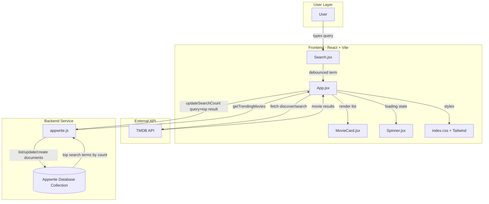

# Movie Explorer

A modern React movie discovery app with search, popular movie browsing, and trending query tracking.

## Table of Contents

1. Overview
2. Full Tech Stack
3. Architecture and Data Flow
4. Component Structure
5. Environment Variables
6. Run Locally

## Overview

Movie Explorer is a frontend-first application that:

- fetches movie data from The Movie Database (TMDB) API,
- lets users search and browse movies,
- stores and ranks popular search terms in Appwrite,
- displays trending searches based on search frequency.

## Full Tech Stack

### Frontend

- React 18 (component-based UI)
- React DOM 18 (browser rendering)
- Vite 6 (dev server and build tool)
- Tailwind CSS 4 (utility-first styling)
- @tailwindcss/vite (Tailwind + Vite integration)
- React Use (debounced search behavior via useDebounce)

### Backend Services (BaaS)

- Appwrite Cloud
- Appwrite JavaScript SDK
- Appwrite Databases API

### Database

- Appwrite Database + Collection
- Stores search analytics documents with:
  - searchTerm
  - count
  - movie_id
  - poster_url

### External APIs

- TMDB REST API (discover + search endpoints)
  - Base: https://api.themoviedb.org/3
  - Auth: Bearer token from VITE_TMDB_API_KEY

### Tooling

- ESLint 9 + React plugins
- Vite React plugin

## Architecture and Data Flow



## Component Structure

```text
src/
  App.jsx                    # app shell, data fetching, state
  appwrite.js                # Appwrite integration
  components/
    Search.jsx               # search input
    MovieCard.jsx            # movie card renderer
    Spinner.jsx              # loading indicator
  main.jsx                   # React entry point
  index.css                  # Tailwind-based styles
```

## Environment Variables

Create .env.local in the project root:

```env
VITE_TMDB_API_KEY=
VITE_APPWRITE_PROJECT_ID=
VITE_APPWRITE_DATABASE_ID=
VITE_APPWRITE_COLLECTION_ID=
```

## Run Locally

```bash
npm install
npm run dev
```

Then open http://localhost:5173
